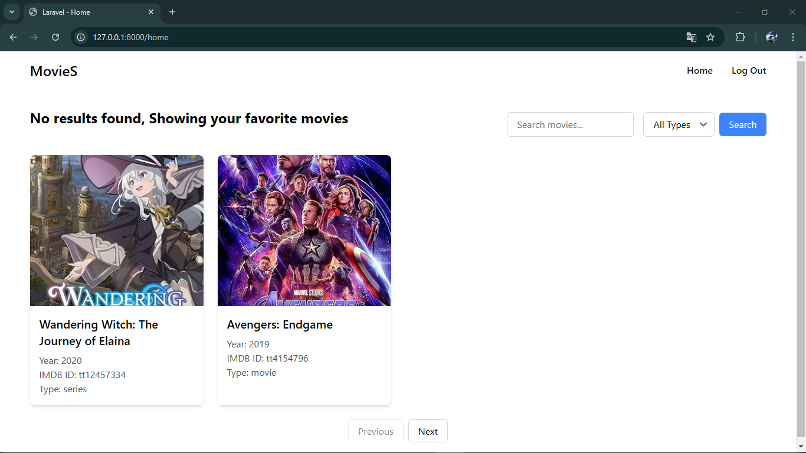

# Laravel Web Test Interview

### Website Demo Link
- 000webhost now have payment and another free hosting lagging upload file

### Installation

- Require PHP 7.*^ (u can change PHP version with Herd in Windows)
- Example of change PHP version with Herd in Windows
- Go To

- Install the PHP 7

- Back to Dashboard
- Select the PHP and choose PHP 7


- Require MySQL
- phpMyAdmin (create database with name laravel5)

```sh
$ git clone https://github.com/fiankurniawan4/movies.git
$ cd movies
```
- Rename .env.example to .env

```sh
$ php artisan key:generate
$ composer install
```

```sh
$ npm install 
$ npm run dev
```

### Image Website



